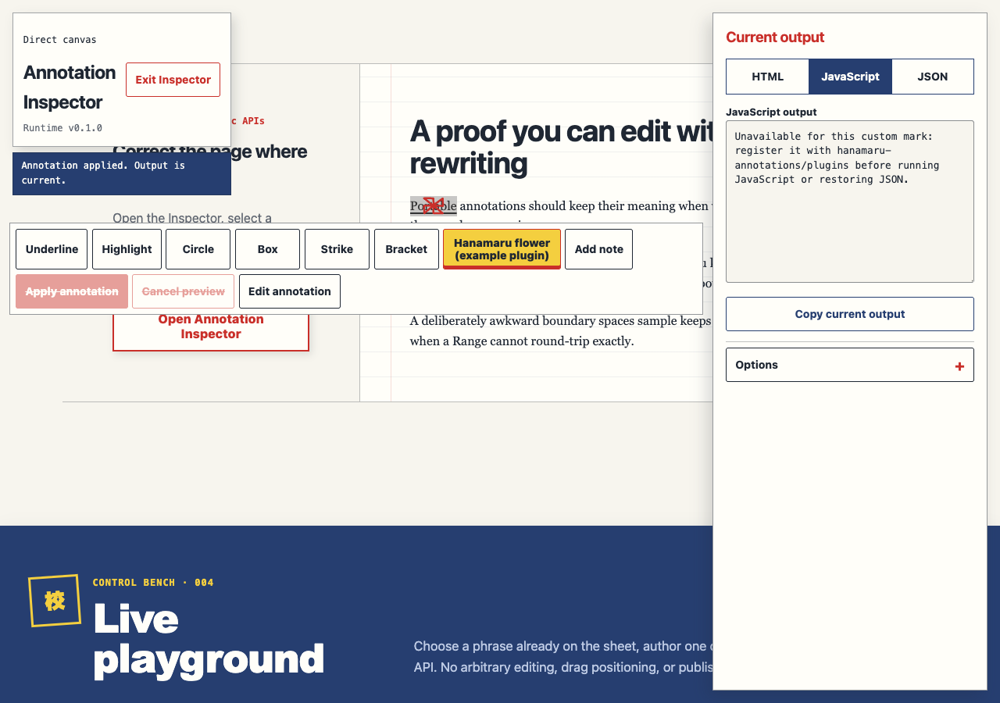

# Hanamaru



Hand-drawn marks, attached notes, and annotation stories that stay aligned while the DOM reflows. Hanamaru is typed, framework-optional, and ships with zero production dependencies.

```sh
npm install hanamaru-annotations@0.1.0
```

```js
import 'hanamaru-annotations/style.css'
import { annotate } from 'hanamaru-annotations'

const correction = annotate('#claim', {
  mark: 'underline',
  note: 'Still attached after reflow',
})

correction.show()
```

That is the complete five-second path: install, import the base stylesheet, create one annotation, and show it. Loading Hanamaru never auto-scans the page.

[Repository](https://github.com/Ray0907/hanamaru) · [local demo source](demo/index.html) · [Changelog](CHANGELOG.md) · [MIT License](LICENSE)

The demo is checked into this repository; no hosted GitHub Pages URL is claimed for the prepared release. From a clone, run `npm install && npm run dev`, then open `http://127.0.0.1:4173/demo/index.html`.

For a version-pinned CDN ESM setup after `0.1.0` is published:

```html
<link
  rel="stylesheet"
  href="https://cdn.jsdelivr.net/npm/hanamaru-annotations@0.1.0/dist/hanamaru.css"
>
<script type="module">
  import { annotate } from 'https://cdn.jsdelivr.net/npm/hanamaru-annotations@0.1.0/dist/hanamaru.esm.js'

  annotate('#claim', { mark: 'circle' }).show()
</script>
```

This is a direct, pinned `dist` ESM and CSS example—not a UMD or npm-subpath emulation. Under Content-Security-Policy, allow `https://cdn.jsdelivr.net` in both `script-src` and `style-src`, or self-host the same files.

## Core API

The main ESM entry exposes exactly eight names:

```js
import {
  VERSION,
  annotate,
  scan,
  story,
  HanamaruError,
  HanamaruConfigError,
  HanamaruTargetError,
  HanamaruStateError,
} from 'hanamaru-annotations'
```

`VERSION` is `"0.1.0"`. `HanamaruError` is the public base class. `HanamaruConfigError`, `HanamaruTargetError`, and `HanamaruStateError` distinguish invalid configuration, unresolved/invalid targets, and runtime or lifecycle failures. Errors carry `code`, `message`, and optional `details`.

### Declarative annotations

`scan(root = document)` finds descendants with `data-hana` and returns `{ annotations, errors }`. Valid siblings still mount when one declarative node is invalid; that typed error is collected in `errors`. Unexpected programmer failures roll the scan back and are rethrown.

```html
<span
  data-hana="highlight"
  data-hana-note="Meaningful supporting context"
  data-hana-placement="auto"
  data-hana-trigger="viewport"
  data-hana-accessible
  data-hana-seed="proof-1"
  data-hana-duration="650"
  data-hana-motion="system"
>
  reliable annotation
</span>

<script type="module">
  import 'hanamaru-annotations/style.css'
  import { scan } from 'hanamaru-annotations'

  const { annotations, errors } = scan()
</script>
```

| Attribute | Meaning |
| --- | --- |
| `data-hana` | Required mark name |
| `data-hana-note` | Optional note text |
| `data-hana-placement` | `auto`, `top`, `right`, `bottom`, or `left` |
| `data-hana-trigger` | `manual`, `load`, or `viewport` |
| `data-hana-accessible` | Presence means `accessible: true` |
| `data-hana-seed` | Stable seed string |
| `data-hana-duration` | Non-negative integer milliseconds |
| `data-hana-motion` | `system` or `never` |

Unknown `data-hana-*` attributes are ignored. Known attributes with invalid values produce a `HanamaruConfigError`.

### Targets and options

`annotate(target, options)` accepts four target forms:

- a connected `Element`;
- a unique CSS selector string;
- a connected native `Range`;
- a scoped exact-text locator such as `{ within: '#proof', text: 'exact phrase', occurrence: 0 }`.

Exact-text matching is case-sensitive, normalizes consecutive Unicode whitespace, and does not inject wrappers. `occurrence` is zero-based; without it, multiple matches are an error.

```js
const annotation = annotate(
  { within: '#proof', text: 'exact phrase', occurrence: 0 },
  {
    mark: 'highlight',
    note: 'Resolved without changing the prose',
    placement: 'auto',
    trigger: 'manual',
    accessible: true,
    seed: 'claim-1',
    duration: 650,
    motion: 'system',
  },
)
```

The six built-in marks are `underline`, `highlight`, `circle`, `box`, `strike`, and `bracket`.

| Option | Domain and default |
| --- | --- |
| `mark` | Required built-in or registered custom mark |
| `note` | String or `null`; default `null`, maximum 280 Unicode code points |
| `placement` | `auto` (default), `top`, `right`, `bottom`, `left` |
| `trigger` | `manual` (default), `load`, `viewport` |
| `accessible` | Boolean, default `false` |
| `seed` | String or finite number; otherwise a controller-stable generated ID |
| `duration` | Non-negative integer milliseconds, default `650` |
| `motion` | `system` (default) or `never` |

An Annotation controller exposes `state`, `finished`, `show()`, `hide()`, `update()`, `replay()`, `refresh()`, and `destroy()`. Its states are `idle`, `showing`, `visible`, `hidden`, `suspended`, and `destroyed`; methods return the controller.

Before an accepted run, `finished` is `null`. Each accepted `show()` or `replay()` creates a per-run Promise that resolves when state reaches `visible`. Replacing, hiding, or destroying a pending run rejects it with `AbortError`; typed target/runtime failures reject with the corresponding Hanamaru error. Option and target updates validate atomically before replacing the current configuration.

### Stories

`story(steps, options)` plays an ordered sequence. Construction validates every step and resolves every initial target before mounting any output.

```js
const proof = story([
  { target: '#claim', mark: 'underline' },
  {
    target: { within: '#proof', text: 'stays attached' },
    mark: 'circle',
    note: 'Even after reflow',
  },
], {
  trigger: 'manual',
  gap: 180,
  motion: 'system',
})

proof.play()
await proof.finished
```

Story options are `trigger`, `gap`, `motion`, and `once`; `once` is valid only for a `viewport` Story. A Story controller exposes `play()`, `pause()`, `resume()`, `cancel()`, `replay()`, and `destroy()`, with states `idle`, `playing`, `paused`, `complete`, `cancelled`, and `destroyed`.

Trigger behavior is explicit:

- `manual` never starts automatically.
- `load` waits for `DOMContentLoaded`, or queues a microtask when the document is already ready.
- `viewport` uses IntersectionObserver threshold `0.25`. An Annotation starts once and remains visible. A Story with `once: false` cancels on full exit and replays on a later entry.

`motion: 'system'` honors `prefers-reduced-motion`; `motion: 'never'` also skips interpolation. Either reduced path makes durations and Story gaps zero while preserving the same lifecycle order, states, promises, and events.

Controllers dispatch composed, bubbling `hana:start`, `hana:step`, `hana:pause`, `hana:complete`, `hana:cancel`, and `hana:error` events from the resolved owner element. `hana:step` and `hana:pause` are Story-only.

## Optional modules

Optional ESM entries share the same emitted singleton as the core. They are thin additions with no duplicate runtime and remain absent from the core IIFE/global.

| Subpath | Exact exports |
| --- | --- |
| `hanamaru-annotations/selection` | `annotateSelection` |
| `hanamaru-annotations/group` | `group` |
| `hanamaru-annotations/plugins` | `registerMark` |
| `hanamaru-annotations/serialize` | `serialize`, `restore`, `resolveSerializedTarget` |
| `hanamaru-annotations/shadow` | `createShadowScope` |
| `hanamaru-annotations/react` | `useAnnotation` |
| `hanamaru-annotations/vue` | `useAnnotation` |
| `hanamaru-annotations/svelte` | `annotation` |

### Selection

Turn the current single, non-collapsed native Selection into a normal Range-backed controller:

```js
import { annotateSelection } from 'hanamaru-annotations/selection'

const selected = annotateSelection({
  mark: 'circle',
  note: 'Review this selection',
})

selected.show()
```

An explicit `Selection` can be the second argument. Hanamaru clones its one Range immediately and does not clear or mutate the user's selection. Empty, multi-range, disconnected, cross-document, and cross-root selections throw `HanamaruTargetError`. A Shadow-rooted selection requires `scope.annotateSelection(...)`.

### Parallel Group

Group is an atomic, parallel complement to ordered Story:

```js
import { group } from 'hanamaru-annotations/group'

const corrections = group([
  { target: '#claim', mark: 'underline' },
  { target: '#result', mark: 'circle', note: 'Check this' },
], {
  trigger: 'manual',
  motion: 'system',
})

corrections.show()
await corrections.finished
```

The Group controller exposes `state`, `finished`, read-only `size`, `show()`, `hide()`, `replay()`, `refresh()`, and `destroy()`. Every member is preflighted before output is acquired; one runtime member failure contains and hides the whole run.

### Custom SVG marks

`registerMark(name, factory)` returns an idempotent unregister function. The factory receives frozen geometry plus deterministic `helpers.jitter`, `helpers.line`, and `helpers.closedPath`; it returns path-data strings while Hanamaru retains rendering, placement, lifecycle, accessibility, and cleanup.

```js
import { registerMark } from 'hanamaru-annotations/plugins'

const unregister = registerMark('hanamaru', ({ unionRect, helpers }) => {
  const { left, right, top, bottom } = unionRect
  const centerX = (left + right) / 2
  const centerY = (top + bottom) / 2

  return {
    paths: [
      helpers.closedPath([
        { x: centerX, y: top - 8 },
        { x: right + 8, y: centerY },
        { x: centerX, y: bottom + 8 },
        { x: left - 8, y: centerY },
      ], { label: 'flower', wobble: 1.5 }),
    ],
  }
})

annotate('#claim', { mark: 'hanamaru' }).show()
unregister()
```

Names are lowercase ASCII/hyphen identifiers up to 48 characters and cannot replace built-ins. A factory can return at most 32 valid paths, each at most 16,384 code units. Registration is runtime-local; TypeScript consumers augment `HanamaruMarkMap` separately for custom literal completion.

Custom mark factories are trusted executable JavaScript, not a sandboxed data format. Frozen geometry and deterministic helpers make valid path output repeatable; they do not restrict what caller-provided code can do in its JavaScript realm. Install factories only from code you trust.

### Versioned serialization

Serialization supports Annotation, Story, and Group:

```js
import {
  serialize,
  restore,
  resolveSerializedTarget,
} from 'hanamaru-annotations/serialize'

const definition = serialize(annotation, {
  keyForTarget(target, context) {
    return context.ownerElement.dataset.annotationKey
  },
})

const restored = restore(definition, {
  root: document,
  resolveTarget(key, context) {
    return document.querySelector(
      `[data-annotation-key="${CSS.escape(key)}"]`,
    )
  },
})

const exactTarget = resolveSerializedTarget(definition.target, {
  root: document,
  resolveTarget(key, context) {
    return document.querySelector(
      `[data-annotation-key="${CSS.escape(key)}"]`,
    )
  },
})
```

Every payload is JSON-safe and versioned:

```json
{
  "schema": "hanamaru/v1",
  "kind": "annotation",
  "target": { "type": "selector", "selector": "#claim" },
  "options": {
    "mark": "underline",
    "note": null,
    "placement": "auto",
    "trigger": "manual",
    "accessible": false,
    "seed": "claim-1",
    "duration": 650,
    "motion": "system"
  }
}
```

Selector and selector-scoped locator targets serialize directly. Direct Element/Range targets, or a locator scoped by Element identity, require `keyForTarget`; restore then requires a `resolveTarget` callback returning the declared connected Element or Range kind. Hanamaru does not generate CSS paths or selectors. `restore()` accepts a parsed object, not a JSON string, validates synchronously, and never partially restores Story/Group members.

### Shadow DOM

Shadow support is explicit and exact-root scoped:

```js
import { createShadowScope } from 'hanamaru-annotations/shadow'
// Asset subpath for bundlers or URL resolution; a document-level import does
// not make CSS cross a Shadow boundary:
import 'hanamaru-annotations/shadow/style.css'

const root = host.shadowRoot
const scope = createShadowScope(root, {
  styles: { mode: 'auto', nonce: window.cspNonce },
})

scope.annotate('#inside-shadow', {
  mark: 'bracket',
  note: 'Owned by this root',
}).show()
```

The style modes are:

- `'auto'`: adopt a package-created constructable stylesheet when supported, otherwise insert an owned `<style>`; optional `nonce` is copied to that fallback node.
- `'sheet'`: adopt a caller-provided, same-realm `CSSStyleSheet` containing the packaged shadow CSS and marker.
- `'preinstalled'`: create no dynamic style. The exact root must already contain the packaged shadow style marker, suitable for strict CSP.

For strict CSP that disallows dynamic styles, load the contents of `hanamaru-annotations/shadow/style.css` into the exact root as an external/preinstalled sheet, then use `{ styles: { mode: 'preinstalled' } }`. A retained closed ShadowRoot is supported because the caller passes the retained reference. Hanamaru does not discover or traverse nested, deep, or cross-root Shadow DOM. Each nested root requires its own `createShadowScope(root)`, and destroying the scope destroys only controllers it owns.

The scope facade includes `annotate`, `annotateSelection`, `scan`, `story`, `group`, `restore`, `resolveSerializedTarget`, and `destroy`.

### React, Vue, and Svelte

The adapters own only the manual Annotation controllers they create. They mount and show in the framework lifecycle, atomically update when options change, destroy on disable/unmount, and forward asynchronous failures to optional `onError`. They do not duplicate the framework-free runtime.

React optional peer `react` is `>=18.2.0 <20`:

```tsx
import { useRef } from 'react'
import { useAnnotation } from 'hanamaru-annotations/react'

function Claim() {
  const target = useRef(null)
  const controller = useAnnotation(target, {
    mark: 'underline',
    note: 'React lifecycle',
  })
  return <span ref={target}>Claim</span>
}
```

Vue 3.5 optional peer `vue` is `>=3.5.0 <4`:

```vue
<script setup>
import { ref } from 'vue'
import { useAnnotation } from 'hanamaru-annotations/vue'

const target = ref()
const controller = useAnnotation(target, {
  mark: 'circle',
  note: 'Vue lifecycle',
})
</script>

<template><span ref="target">Claim</span></template>
```

Svelte 5 optional peer `svelte` is `>=5.0.0 <6`:

```svelte
<script>
  import { annotation } from 'hanamaru-annotations/svelte'
</script>

<span use:annotation={{ mark: 'highlight', note: 'Svelte action' }}>
  Claim
</span>
```

Adapter options intentionally omit `trigger`; lifecycle adapters always create a manual annotation. `enabled` defaults to `true`. React and Vue `useAnnotation` expose the current controller ref; Svelte's action supports `update`, `destroy`, and optional `onController`.

## Accessibility and security

SVG marks and connectors are decorative with `aria-hidden="true"`. Notes are decorative by default. Set `accessible: true` only when a note adds meaningful supporting information; Hanamaru then adds its stable note ID to the target owner's `aria-describedby`. Teardown removes only the token Hanamaru owns and preserves author tokens and other active annotations.

Meaningful notes supplement rather than replace essential visible text. Long accessible notes become keyboard-focusable when their internal content scrolls. Notes and toolbars are clamped to the visual viewport; offscreen annotation output is suppressed until normal observation or `refresh()` brings it back.

`prefers-reduced-motion: reduce` skips interpolation and gaps but preserves the same states, lifecycle order, output, promises, and events. `motion: 'never'` applies the same runtime policy explicitly.

The demo Annotation Inspector uses an Exit control, a labeled status region, a mark toolbar with a roving tab stop, Arrow-key navigation, Enter or Space activation, and Escape to close the topmost note editor/palette before leaving Inspector mode. Focus returns to the connected opener. Readonly HTML/JavaScript/JSON outputs stay selectable, and copy failure exposes a selected fallback.

Hanamaru's core rendering uses DOM/SVG APIs and does not inject scripts or call `eval`. With strict CSP:

- self-host or allow the pinned CDN origin in `script-src` and `style-src`;
- serve base CSS as an external stylesheet;
- for Shadow styles, use the fallback `nonce`, pass a validated same-realm sheet, or use `'preinstalled'` mode when dynamic style creation is forbidden.

Custom mark factories are trusted executable JavaScript and can perform any side effect allowed to caller code, including DOM, timer, observer, and event work. Hanamaru does not sandbox factories. It validates and bounds only the returned SVG path data and the geometry handed to the renderer. CSP prevents Hanamaru itself from injecting script/style in the documented modes; it does not make a malicious or careless plugin safe. Serialization resolvers are trusted application callbacks too and should map stable keys rather than evaluate payload contents.

## Browser support

The release verification uses Playwright 1.61.1 against ES2020 output:

| Engine | Exact verified build | Coverage |
| --- | --- | --- |
| Chromium | 149.0.7827.55 | Full browser, docs, Inspector, accessibility, CSP, optional-module suites |
| Firefox | 151.0 | Core and Shadow smoke suites |
| WebKit | 26.5 | Core and Shadow smoke suites |

These are exact tested builds, not minimum-version claims. Older or different engine versions are not claimed by `0.1.0`.

Capability degradation is explicit:

- without `ResizeObserver`, window-resize handling remains; call `refresh()` after other size changes;
- without `IntersectionObserver`, `viewport` trigger behavior degrades to `load`;
- without Web Animations API, CSS animation plus an elapsed-time fallback preserves lifecycle settlement;
- CSS Highlight API is not required because Element/Range geometry renders through SVG.

## Size and distribution

Hanamaru has zero production dependencies. `dist/size-report.json` schema version 2 uses gzip level 9 and closure accounting: main ESM includes its transitive local chunks plus base CSS; an optional entry is charged only the transitive package chunks not already charged to main; shared optional chunks are conservatively charged to each optional closure; Shadow also includes its separate stylesheet.

Fresh `0.1.0` measurements:

| Closure | Measured gzip bytes | Hard cap | Stretch target | Stretch |
| --- | ---: | ---: | ---: | --- |
| `main` | 28,156 | 28,672 | 27,648 | miss |
| `iife` | 24,069 | 24,576 | 23,552 | miss |
| `selection` | 1,084 | 3,072 | 2,560 | pass |
| `serialize` | 10,577 | 11,264 | 10,752 | pass |
| `group` | 4,881 | 8,192 | 7,680 | pass |
| `plugins` | 2,087 | 6,144 | 5,632 | pass |
| `shadow` | 20,032 | 21,504 | 20,480 | pass |
| `react` | 2,926 | 4,096 | 3,584 | pass |
| `vue` | 3,132 | 4,096 | 3,584 | pass |
| `svelte` | 3,315 | 4,096 | 3,584 | pass |

Every hard cap is enforced. Stretch targets are report-only: main and IIFE miss their stretch targets while remaining inside their hard caps. The measurements are package bytes, not transfer, parse-time, or performance claims. Re-run `npm run build && npm run check:dist`; the generated schema-v2 report is the source of truth.

The package contains core ESM/IIFE, optional ESM entries, two opt-in stylesheets, declarations for every public entry, README, license, and package metadata. Framework packages are optional peers and no `dependencies` key is shipped.

## Limits and failure behavior

- Supported target forms are a selector string, connected Element, native Range, and scoped exact-text locator. A selector must resolve uniquely; locators are case-sensitive after Unicode-whitespace normalization.
- Element and Range targets retain node identity. Replacement nodes are not adopted implicitly. Selector/selector-scoped locator targets can re-resolve; a replaced Range needs `update({ target: nextRange })`.
- CSS-only transform movement emits no observer signal; call `refresh()` explicitly.
- Standalone APIs work in a Document, including an explicitly supplied iframe Document where supported by that API. Cross-iframe targets are never inferred or combined.
- There is no implicit deep or cross-root Shadow DOM traversal. Open and retained closed roots work only through the exact `createShadowScope(root)` facade; nested roots need separate scopes.
- Serialization never invents identity selectors. A key resolver must return the required connected Element or Range, in the requested root, and locator `within` keys must resolve to an Element.
- Selection requires exactly one connected, non-collapsed Range in one root and is cloned at acceptance.
- Group and Story aggregate construction is atomic. They do not accept nested controllers as members.
- Plugins produce only bounded SVG path data. Custom executable factories are not serialized; register the mark before restore.
- Image/canvas/freehand annotation, arbitrary-site persistence, accounts, cloud sync, collaboration, AI/QA rules, cross-document aggregate groups, browser extensions, and drag-position editing are outside `0.1.0`.

Invalid configuration throws `HanamaruConfigError`; missing, ambiguous, disconnected, or wrong-root targets throw `HanamaruTargetError`; plugin, serialization-state, and asynchronous runtime failures surface as `HanamaruStateError`. Hanamaru uses no silent fallback to a different target, mark, root, resolver kind, or Shadow style mode. The declarative `scan()` collection and documented missing-browser-capability behavior are the only contained degradation paths.

## Development

Hanamaru is a browser package and has no consumer-facing `engines` gate, so installing it does not impose the repository's Node toolchain on applications using Node 20, 22, 25, or another npm-supported runtime. Contributors are intentionally stricter: npm `devEngines` requires Node `>=24.13.0 <25` with `onFail: error`, and CI pins Node 24.13.0.

```sh
npm install
npm run verify
```

`npm run verify` is ordered and non-empty: unit tests, TypeScript fixtures, production build, distribution/export/tarball-shape/size checks, full Chromium E2E, Firefox/WebKit smoke, then isolated React/Vue/Svelte adapter suites. The read-only CI and tag workflows use least-privilege `contents: read` and produce a digest-identified tarball without npm credentials.

The local Inspector is a proof and authoring surface, not a second runtime. Its generated JSON is enabled only when a selected Range round-trips through public `resolveSerializedTarget()` with identical boundaries.

## License

[MIT License](LICENSE) © 2026 Hanamaru contributors.
