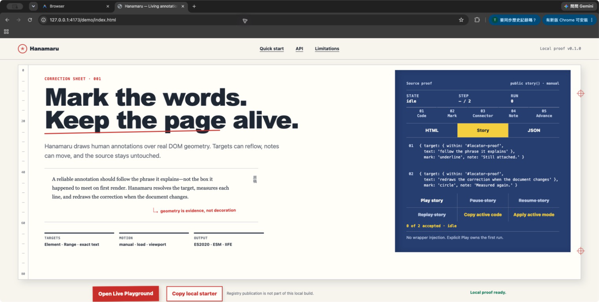

# Hanamaru


Hanamaru is a framework-free DOM annotation runtime for expressive marks, attached notes, and ordered annotation stories that stay aligned while a page reflows. It uses ordinary HTML, CSS, and a small JavaScript runtime with zero production dependencies.

This repository is a local implementation. The package name is `hanamaru-annotations`, but registry publication is not part of this local build.

- [Quick Start](#quick-start)
- [API](#api)
- [Accessibility](#accessibility)
- [Theming](#theming)
- [Browser Support](#browser-support)
- [Fallbacks](#fallbacks)
- [Size and Distribution](#size-and-distribution)
- [Limitations](#limitations)
- [Contributing](#contributing)
- [License](#license)

## Quick Start

Build the repository checkout locally. Here, `npm install` installs contributor and test tooling; it is not a package-consumer installation command.

```sh
npm install
npm run build
```

The build writes ES2020 ESM, IIFE, and base CSS files to `dist/`. Copy those local files beside your page, add a declarative annotation, and choose when to scan:

```html
<p>
  Hanamaru keeps
  <span
    data-hana="highlight"
    data-hana-note="Still attached after reflow"
    data-hana-placement="auto"
  >
    notes connected
  </span>.
</p>

<link rel="stylesheet" href="./dist/hanamaru.css">
<script type="module">
  import { scan } from './dist/hanamaru.esm.js'
  scan()
</script>
```

The browser-script equivalent is:

```html
<link rel="stylesheet" href="./dist/hanamaru.css">
<script src="./dist/hanamaru.iife.js"></script>
<script>Hanamaru.scan()</script>
```

Neither local build auto-scans. Loading the files alone does no target work and creates no overlay; the explicit `scan()` call decides when declarative annotations are mounted. Registry publication is not part of this local implementation.

## API

Hanamaru has two entry layers over the same controllers: declarative attributes for the short path and imperative functions for precise targets, lifecycle control, and stories.

### Public exports (exactly eight)

```js
import {
  VERSION,
  annotate,
  story,
  scan,
  HanamaruError,
  HanamaruConfigError,
  HanamaruTargetError,
  HanamaruStateError,
} from './dist/hanamaru.esm.js'
```

The IIFE exposes the same names on `window.Hanamaru`. `HanamaruError` is the public base class. Target, configuration, and asynchronous runtime failures use the three typed subclasses; each carries `code`, `message`, and optional `details`.

### Declarative annotations

`scan(root = document)` finds descendants with `data-hana` and returns `{ annotations, errors }`. Invalid declarative nodes are skipped and collected in `errors` without blocking valid siblings. An unexpected programmer error rolls back annotations already created by that scan and is rethrown.

```html
<span
  data-hana="circle"
  data-hana-note="A meaningful correction"
  data-hana-placement="auto"
  data-hana-trigger="viewport"
  data-hana-accessible
  data-hana-seed="proof-1"
  data-hana-duration="650"
  data-hana-motion="system"
>
  reliable annotation
</span>
```

The canonical attributes are:

| Attribute | Value |
| --- | --- |
| `data-hana` | Required `mark` name |
| `data-hana-note` | `note` text |
| `data-hana-placement` | `placement` name |
| `data-hana-trigger` | `trigger` name |
| `data-hana-accessible` | Present means `accessible: true` |
| `data-hana-seed` | Stable `seed` string |
| `data-hana-duration` | Non-negative integer `duration` in milliseconds |
| `data-hana-motion` | `motion` policy |

Unknown `data-hana-*` attributes are ignored. A known attribute with an invalid value produces a collected `HanamaruConfigError`.

### Targets and imperative annotations

`annotate(target, options)` accepts four target forms:

- an `Element`;
- a unique CSS selector string;
- a caller-created native `Range`;
- a scoped exact-text locator such as `{ within: '#proof', text: 'unwrapped phrase', occurrence: 0 }`.

Exact-text matching is case-sensitive, normalizes consecutive Unicode whitespace, and never injects a wrapper. Without `occurrence`, multiple matches are an error; `occurrence` is zero-based.

```js
import { annotate } from './dist/hanamaru.esm.js'

const annotation = annotate(
  { within: '#proof', text: 'unwrapped phrase' },
  {
    mark: 'highlight',
    note: 'Resolved without changing the prose',
    placement: 'auto',
    trigger: 'manual',
  },
)

annotation.show()
await annotation.finished
```

The annotation options are:

| Option | Values and default |
| --- | --- |
| `mark` | Required: `underline`, `highlight`, `circle`, `box`, `strike`, or `bracket` |
| `note` | String or `null` (default); empty becomes `null`, maximum 280 Unicode code points |
| `placement` | `auto` (default), `top`, `right`, `bottom`, or `left`; viewport visibility wins |
| `trigger` | `manual` (default), `load`, or `viewport` |
| `accessible` | Boolean, default `false` |
| `seed` | String or finite number; otherwise a controller-stable generated ID |
| `duration` | Non-negative integer milliseconds, default `650` |
| `motion` | `system` (default) or `never` |

Every annotation controller exposes `state`, `finished`, `show()`, `hide()`, `update()`, `replay()`, `refresh()`, and `destroy()`. Control methods return the controller. States are `idle`, `showing`, `visible`, `hidden`, `suspended`, and `destroyed`.

Before an accepted run, `finished` is `null`. Each accepted `show()` or `replay()` creates a per-run Promise that resolves at `visible`. Replacing a pending run, hiding it, or destroying it rejects that Promise with `AbortError`; a target or runtime failure rejects it with the corresponding typed error. Calls that are invalid for the current state are safe no-ops.

Hanamaru observes relevant resize, scroll, and scoped DOM changes and coalesces measurements. CSS-only movement that emits none of those signals—such as an independent transform animation—requires an explicit `refresh()` call.

A native `Range` is cloned around the same boundary nodes. `refresh()` can remeasure those nodes but cannot infer replacement nodes. After replacement, create the new range and use `update({ target: nextRange })`:

```js
const nextRange = document.createRange()
nextRange.selectNodeContents(document.querySelector('#replacement'))
annotation.update({ target: nextRange })
```

Target and option replacement is atomic: validation happens before the swap, so a failed replacement leaves the previous annotation configuration intact.

### Story API

`story(steps, options)` validates every step and resolves every initial target before mounting. A failure throws a typed error without leaving a partial story.

```js
import { story } from './dist/hanamaru.esm.js'

const proof = story([
  { target: '#claim', mark: 'underline' },
  {
    target: { within: '#proof', text: 'stays attached' },
    mark: 'circle',
    note: 'Even after reflow',
    placement: 'auto',
  },
], {
  trigger: 'manual',
  gap: 180,
  motion: 'system',
})

proof.play()
await proof.finished
```

Story options are `trigger` (`manual`, `load`, or `viewport`), non-negative integer `gap` (default `180`), `motion` (`system` or `never`), and `once`. `once` is valid only with `viewport` and defaults to `true` there. Steps accept annotation options except `trigger` and `motion`, which the story owns for the entire run.

A story controller exposes `state`, `finished`, `play()`, `pause()`, `resume()`, `cancel()`, `replay()`, and `destroy()`. Its states are `idle`, `playing`, `paused`, `complete`, `cancelled`, and `destroyed`. `play()` starts only from `idle`; use `replay()` for later runs. A per-run Promise resolves at `complete` and rejects with `AbortError` on cancellation, replay, or destruction.

### Triggers and motion

- `manual` never starts automatically.
- `load` waits for `DOMContentLoaded`, or starts in a microtask when the document is already ready.
- A `viewport` annotation starts on its first IntersectionObserver entry at threshold `0.25`, remains visible after exit, and disconnects that trigger.
- A `viewport` story watches its first target at threshold `0.25`. With `once: true`, it starts once. With `once: false`, full exit cancels an active run and a later entry replays it.
- `motion: 'system'` respects `prefers-reduced-motion`; `motion: 'never'` also skips interpolation. Reduced motion makes durations and story gaps zero while preserving the same logical order of lifecycle events.

### Lifecycle events

Controllers dispatch bubbling, composed `CustomEvent`s from the resolved owner element. Story events use the first step's owner. The public events are:

| Event | Detail |
| --- | --- |
| `hana:start` | `{ controller, state }` |
| `hana:step` | Story only: `{ controller, index, total, annotation }` |
| `hana:pause` | Story only: `{ controller, index }` |
| `hana:complete` | `{ controller, state }` |
| `hana:cancel` | `{ controller, reason }` |
| `hana:error` | `{ controller, error, index? }` |

## Accessibility

Marks and connectors are decorative SVG output with `aria-hidden="true"`. Notes are decorative by default. Set `accessible: true` only for a meaningful note; Hanamaru then adds a stable note ID to the owner element's `aria-describedby` token list. Destruction removes only the token Hanamaru owns and preserves author tokens and other active annotations.

Notes should supplement, not replace, essential visible instructions or status. Notes are clamped inside the 12-pixel safe inset of the visual viewport and wrap long text. Overflowing accessible notes become keyboard-focusable so their internally scrolling content remains reachable; decorative notes do not intercept input.

With `prefers-reduced-motion: reduce`, final marks, connectors, notes, states, promises, and events still appear, but drawing interpolation and gaps are skipped. When a target is outside the visual viewport, offscreen annotation output is suppressed; normal layout observation restores it when the target returns.

## Theming

Load `dist/hanamaru.css`, then override custom properties on `.hana-overlay` or an inherited scope:

The canonical variables are `--hana-color`, `--hana-mark-color`, `--hana-note-color`, `--hana-stroke-width`, `--hana-padding`, `--hana-note-gap`, `--hana-font`, `--hana-duration`, and `--hana-z-index`.

```css
.hana-overlay {
  --hana-color: #9d241f;
  --hana-mark-color: #9d241f;
  --hana-note-color: #1f2733;
  --hana-stroke-width: 3px;
  --hana-padding: 0.6rem 0.75rem;
  --hana-note-gap: 18px;
  --hana-font: 600 0.9rem/1.4 system-ui, sans-serif;
  --hana-duration: 520ms;
  --hana-z-index: 1000;
}
```

The base stylesheet also exposes `--hana-highlight-color` and `--hana-note-background`. Hanamaru owns only `.hana-*` selectors and `data-hana-*` attributes; it does not style bare host elements.

## Browser Support

The fixed Playwright suite exercises these ES2020 outputs:

- Chromium — full unit-to-browser behavior and documentation suite;
- Firefox — core bootstrap, target, lifecycle, and teardown smoke suite;
- WebKit — the same core smoke suite.

This local implementation intentionally makes no untested version matrix claim.

## Fallbacks

- No `ResizeObserver`: Hanamaru keeps window resize handling; call `refresh()` explicitly after other relevant size changes.
- No `IntersectionObserver`: a `viewport` trigger degrades to `load`.
- No Web Animations API: CSS animation plus an internal elapsed-time fallback preserves pause, resume, and completion.
- No CSS Highlight API: it is irrelevant to correctness because native Range and locator geometry render through SVG.
- Clipboard write failure in the demo reveals a readonly, selected, selectable fallback field containing the same local code.

## Size and Distribution

Hanamaru has zero production dependencies. `npm run build` emits ES2020 `hanamaru.esm.js`, `hanamaru.iife.js`, and `hanamaru.css`; the latter is required by both JavaScript formats.

Size verification uses gzip level 9 and measures each complete JavaScript + CSS pair. The hard cap is 20,480 combined gzip bytes per format. The 18,432-byte stretch target is report-only and never weakens the hard check.

The current local `dist/size-report.json` reports:

| Format | JS + CSS, gzip level 9 | Hard budget | Stretch target |
| --- | ---: | --- | --- |
| `hanamaru.esm.js` | 18,769 bytes | pass | miss |
| `hanamaru.iife.js` | 18,964 bytes | pass | miss |

These are local build measurements, not network-transfer, parse-time, or performance claims. Re-run `npm run build && npm run check:dist` after source changes; the generated report is the source of truth.

## Limitations

V1 deliberately excludes:

- browser extensions and arbitrary-site persistence;
- accounts, cloud storage, collaboration, and shared review links;
- React, Vue, and other framework wrappers;
- AI generation, QA rules, and lint engines;
- image, canvas, and freehand annotation;
- drag-and-drop layout editing;
- Shadow DOM targeting and cross-iframe targeting;
- package publication and production deployment.

Direct `Element` and native `Range` targets retain node identity: replacement nodes are not adopted implicitly. Selector targets and selector-scoped locators can re-resolve after replacement. Pure CSS movement still needs the explicit `refresh()` noted in the API section.

## Contributing

From a repository checkout with the supported Node version:

```sh
npm install
npm run dev
npm run test:unit
npm run build
npm run check:dist
npm run test:e2e
npm run verify
```

`npm run verify` is the fixed sequence: non-empty unit tests, production build, `check:dist` dependency and size enforcement, the full Chromium E2E suite, then Firefox and WebKit smoke suites. A zero-test stage is a failure.

Keep runtime examples on the public `./dist/hanamaru.esm.js`, `./dist/hanamaru.iife.js`, and `./dist/hanamaru.css` paths. Demo-only recipes do not belong in the runtime bundle.

## License

[MIT](LICENSE) © 2026 Hanamaru contributors.
